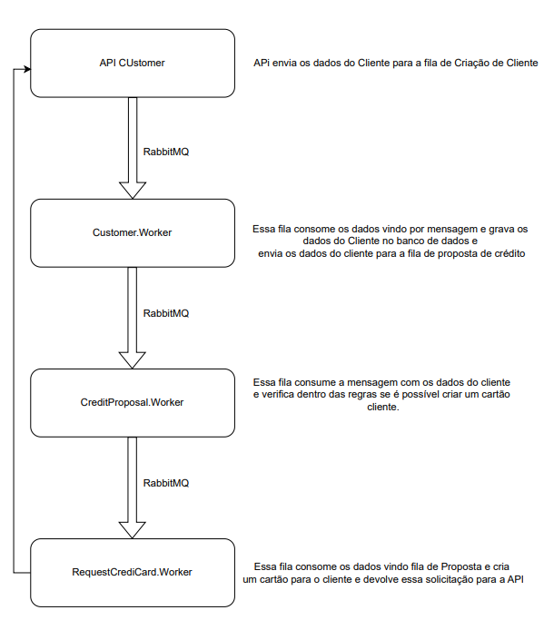

Estrutura de Comunicação:

1. Cadastro de Cliente:
    - Quando um novo cliente é cadastrado, uma mensagem é enviada para a fila que o ‘Customer.Worker’;
2. Proposta de Crédito:
    - O ‘Customer.Worker’ processa a mensagem e envia uma proposta de crédito para a fila que o ‘CreditProposal.Worker’ está escutando.
    - O ‘CreditProposal.Worker’ valida a proposta de crédito. Se a proposta for aprovada, ele envia uma mensagem para a fila que o
    
    ‘RequestCreditCard.Worker’ está escutando. Caso contrário, ele envia uma mensagem de rejeição de volta para o serviço de ‘Cadastro de Cliente’.
    
3. Emissão de Cartão de Crédito:
- O ‘RequestCreditCard.Worker’ emite o cartão de crédito e envia uma mensagem de confirmação para o serviço de ‘Cadastro de Cliente’.

- Fluxograma do sistema:
  

    

